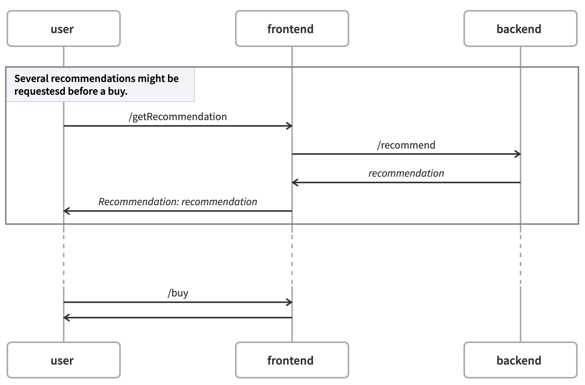
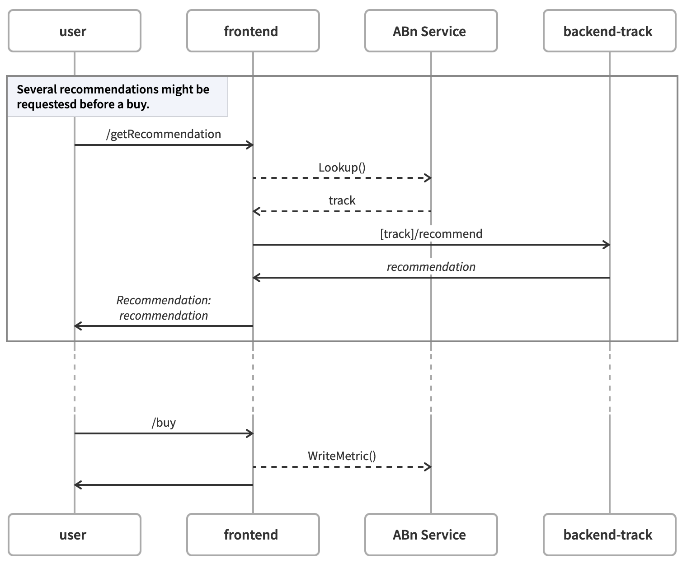

# ab-example

## Use Case

Suppose we have a two tier application. The business logic (frontend) provides a customer facing application that recommends products to a user. The user can then buy a recommended product if desired. The frontend relies on a backend recommendation service. Given a set of options for the backend recommendation service, we would like to evaluate them to determine which gives us the greatest business benefit; for example, the greatest number of sales.

Note that the benefit of a backend cannot be determined in isolation from the frontend. The benefit comes from the results of (perhaps multiple) recommendations and can be determined only by the frontend service.

To address the challenge of associating a business metric computed by a frontend service with a backend service is addressed by the introduction of the Iter8 SDK and ABn service. The SDK, to be used to implement frontend services, provides two APIs:

- lookup() - identifies a version of the backend service that should be used for a request
- writeMetric() - exports a business metric and associated it with the associated backend service

## Application

This project contains a sample two-tier application that demonstrates the use of the Iter8 SDK by the frontend service.

The frontend service provides two endpoints _/getRecommendation_ and _/buy_. The _/getRecommendation_ endpoint relies on a backend service endpoint _/recommend_:



To compare multiple versions of the backend service, use the Iter8 SDK to identify which version or _track_ of the backend to send a request to and to export metrics to a metrics data:



An Iter8 experiment can then be written to evaluate the versions.

Sample implementations of the frontend service in go, python and node demonstrate the use of the Iter8 API. These are simplified code examples.

## Prerequisite

A Kubernetes cluster with ABn service deployed:

```shell
helm install abn ../../iter8-tools/hub/charts/abn-service-single/ \
--set image=$ABN_SERVICE_TAG \
--set resources='{deployments,services}' \
--set service.name=abn \
--set application=backend
```

## Backend Service

Build:

```shell
docker build . -f backend/Dockerfile -t $BACKEND_TAG
docker push $BACKEND_TAG
```

Deploy two versions of the backend service. One, _v1_ is identified as the _default_ version. The other, _v2_ is the _candidate_ version. While the specific versions will change over time, we always evaluate a candidate version against a default version.

```shell
sed -e "s#BACKEND_TAG#$BACKEND_TAG#" backend/deploy.yaml | kubectl apply -f -
```

Comments:

In order to implement a lookup service, the Iter8 ABn service needs to be able to identify available versions of the backend service and be able to identify them as belonging either to the default or candidate track. To do this, the ABn service relies on resource labels and annotations as follows:

- resources associated with `backend` service, have the label `app.kubernetes.io/name: backend`
- resources associated with the backend service can be partitioned into versions via the label `app.kubernetes.io/version`; resources without this label are ignored
- a version is identified as either default or candidate by the annotation `iter8.tool/track` on a resource
- a version is available if the annotation `iter8.tool/ready: True` is set on some resource associated with the track

In `backend/deploy.yaml`, these labels and annotations are defined as required.

## Frontend Service

Sample implementations are provided in:

- [go](https://github.com/kalantar/ab-example/tree/main/frontend/go)
- [python](https://github.com/kalantar/ab-example/tree/main/frontend/python)
- [node](https://github.com/kalantar/ab-example/tree/main/frontend/node)

### Build

Set `FRONTEND_LANG` to implementation language, one of `go`, `python` or `node`.

Set `FRONTEND_TAG` to the name of a docker image. Then build as follows:

```shell
docker build . -f frontend/$FRONTEND_LANG/Dockerfile -t $FRONTEND_TAG
docker push $FRONTEND_TAG
```

### Deploy

Deploy the frontend service:

```shell
sed -e "s#FRONTEND_TAG#$FRONTEND_TAG#" frontend/deploy.yaml | kubectl apply -f -
```

### Test

Port forward the frontend service:

```shell
kubectl port-forward deploy/frontend 8090:8090
```

Call (perhaps several times):

```shell
curl localhost:8090/getRecommendation -H 'X-User: foo'
```

Note that the returned recommendation is, in fact, the version of the backed service used to process the request.

Then:

```shell
curl localhost:8090/buy -H 'X-User: foo'
```

Currently, the metric is written to the ABn service log:

```shell
kubectl logs -f deploy/abn
```

```shell
data:
  versionname.metricname: <base64 encoded object - count, sum, min, max, ss, lut>
  ...

// great for writing

data:
  versionname:
    metricname:
      encodedmetric: <base64 encoded object - count, sum, min, max, ss>
      lastupdatetime:
    metricname:
    ...
    lastupdatetime: <max of all lut>
  versionname:
  ...

// best for reading, removing old version data


data:
  metricname:
    versionname: <base64 encoded object - count, sum, min, max, ss, lut>
    versionname:
    ...
  metricname:
  ...

// good for writing
```
