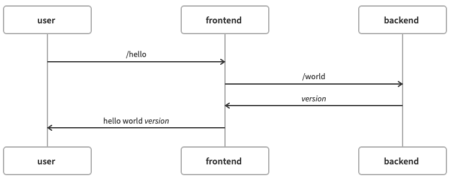
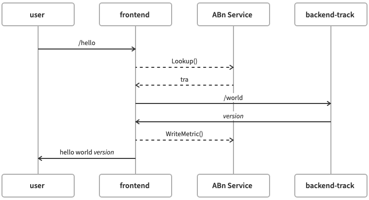

# ab-example

Sample client-server application that demonstrates use of the Iter8 SDK by the frontend service.

The frontend service provides an endpoint _/hello_ which relies on a backend service endpoint _/world_:



To compare multiple versions of the backend service, use the Iter8 SDK to identify which version or _track_ of the backend to send a request to and to export metrics to a metrics data:



An Iter8 experiment can then be written to evaluate the versions.

Sample implementations of the frontend service in go, ... demonstrate the use of the Iter8 API. In these samples, all errors are reported as failures. In practice, a default track might be used.

## Backend Service

Build:

```shell
docker build . -f backend/Dockerfile -t $BACKEND_TAG
docker push $BACKEND_TAG
```

Deploy:

```shell
sed -e "s#BACKEND_TAG#$BACKEND_TAG#" backend/deploy.yaml | kubectl apply -f -
```

## Frontend Service

Sample implementations are provided in:

- [go](https://github.com/kalantar/ab-example/tree/main/frontend/go)
- [python](https://github.com/kalantar/ab-example/tree/main/frontend/python)
- [node](https://github.com/kalantar/ab-example/tree/main/frontend/node)

### Build

Set `FRONTEND_LANG` to implementation language, one of `go`, `python` or `node`.

Set `FRONTEND_TAG` to the name of a docker image. Then build:

```shell
docker build . -f frontend/$FRONTEND_LANG/Dockerfile -t $FRONTEND_TAG
docker push $FRONTEND_TAG
```

### Deploy

Deploy the frontend service:

```shell
sed -e "s#FRONTEND_TAG#$FRONTEND_TAG#" frontend/deploy.yaml | kubectl apply -f -
```

### Test

Port forward the frontend service:

```shell
kubectl port-forward deploy/frontend 8090:8090
```

Call (perhaps several times):

```shell
curl localhost:8090/getRecommendation -H 'X-User: foo'
```

and then:

```shell
curl localhhost:8090/buy -H 'X-User: foo'
